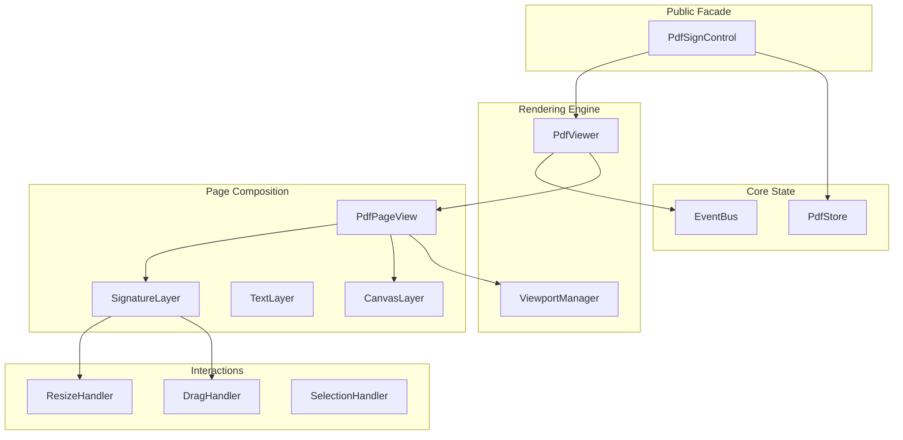

# @shznet/pdf-sign-control - Detailed Implementation Plan

## 1. Architecture & Design

### 1.1 Architecture Diagram



> [!NOTE]
> **Tại sao cần Canvas?** 
> *   `CanvasLayer`: Dùng để render **nội dung gốc của file PDF** (text, ảnh, vector) làm nền (background). PDF.js render ra canvas.
> *   `SignatureLayer`: Là các thẻ `div` trong suốt nằm đè lên Canvas. Chứa các field tương tác (interactive DOM elements).

### 1.2 Core Interfaces

```typescript
// 1. Coordinate System
interface PdfPoint {
  x: number; // PDF Point (bottom-left origin)
  y: number;
}

interface ViewportPoint {
  x: number; // Pixel (top-left origin)
  y: number;
}

// 2. Field Data Model
interface ISignatureField {
  id: string;
  pageIndex: number; // 0-based
  rect: {
    x: number;      // PDF Point
    y: number;      // PDF Point
    width: number;  // PDF Point
    height: number; // PDF Point
  };
  data?: Record<string, any>;
  style?: {
    zIndex?: number;
    backgroundColor?: string;
  };
}

// 3. Main Viewer Interface
interface IPdfViewer {
  // Config
  setDocument(buffer: Uint8Array): Promise<void>;
  
  // Navigation
  get currentPage(): number;
  set currentPage(page: number);
  
  // Zoom
  get scale(): number;
  set scale(val: number); // 1.0 = 100%
  
  // Mode
  get viewMode(): 'scroll' | 'single';
  set viewMode(mode: 'scroll' | 'single');
}
```

### 1.3 Module Responsibilities

| Module | Responsibility | Key Methods |
|--------|----------------|-------------|
| **PdfSignControl** | Facade pattern, public API | `load()`, `zoomIn()`, `addField()` |
| **PdfStore** | Reactive state holder (RxJS or Signals) | `selectZoom()`, `selectFields()` |
| **PdfViewer** | DOM container, managing scroll/layout | `update()`, `scrollToPage()` |
| **PdfPageView** | Render single page, manage layers | `draw()`, `destroy()` |
| **SignatureLayer** | HTML Overlay for fields | `renderFields()`, `updateFieldDOM()` |
| **ViewportManager** | Coordinate conversion logic | `toPdfPoint()`, `toPixelPoint()` |

---

## 2. Directory Structure

```
packages/pdf-sign-control/src/
├── core/
│   ├── PdfSignControl.ts       # Main Entry Class
│   ├── PdfStore.ts             # State Management
│   └── EventBus.ts             # Internal Events
├── viewer/
│   ├── PdfViewer.ts            # Scroll/Single mode logic
│   ├── PdfPageView.ts          # Individual page Logic
│   └── ViewportManager.ts      # Coordinate math
├── layers/
│   ├── LayerFactory.ts
│   ├── CanvasLayer.ts          # PDF.js Canvas wrapper
│   ├── TextLayer.ts            # PDF.js Text layer wrapper
│   └── SignatureLayer.ts       # Logic custom div layer
├── fields/
│   ├── FieldRegistry.ts        # Map<id, FieldInstance>
│   ├── SignatureField.ts       # DOM Element Logic
│   └── interactions/
│       ├── DragHandler.ts
│       ├── ResizeHandler.ts
│       └── InteractionBase.ts
└── utils/
    ├── coordinates.ts          # Math helpers
    └── dom.ts                  # DOM helpers
```

---

## 3. Event System (EventBus)

Avoid tight coupling by using an internal EventBus.

| Event Name | Payload | Triggered When |
|------------|---------|----------------|
| `DOC_LOADED` | `{ pages: number }` | PDF loaded successfully |
| `PAGE_RENDERED` | `{ pageIndex: number }` | A page finishes rendering |
| `ZOOM_UPDATED` | `{ scale: number }` | Zoom level changes |
| `FIELD_ADD` | `{ field: ISignatureField }` | New field added |
| `FIELD_UPDATE` | `{ id, patch }` | Field resized/moved |
| `FIELD_SELECT` | `{ id }` | Use clicks a field |

---

## 4. Performance Strategy

1.  **Rendering Queue**:
    *   Sử dụng `RenderQueue` để ưu tiên render trang đang nhìn thấy (visible).
    *   Hủy (cancel) render task của các trang đã cuộn qua.

2.  **Layer Composition**:
    *   `CanvasLayer` chỉ render lại khi Zoom thay đổi.
    *   `SignatureLayer` là DOM elements, khi drag/drop chỉ update `transform`, không re-layout toàn bộ.

3.  **Coordinate Caching**:
    *   Cache `viewport` object của PDF.js cho mỗi mức zoom để tránh tính toán lại matrix liên tục.

---

## 5. Wrapper Strategy (React Example)

```typescript
// React Wrapper Usage
const App = () => {
  const controlRef = useRef<PdfSignControl>(null);

  // Sync props to imperative API
  useEffect(() => {
    if(controlRef.current) {
      controlRef.current.setZoom(props.zoom);
    }
  }, [props.zoom]);

  // Subscribe events to callbacks
  useEffect(() => {
    const unsub = controlRef.current.on('FIELD_UPDATE', (e) => {
       props.onFieldChange(e);
    });
    return unsub;
  }, []);

  return <div id="pdf-container" />;
}
```
